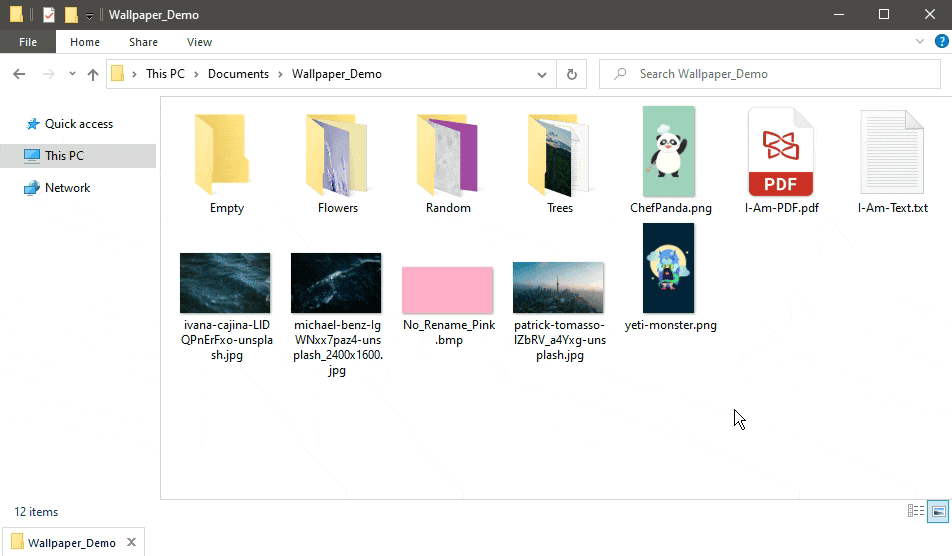
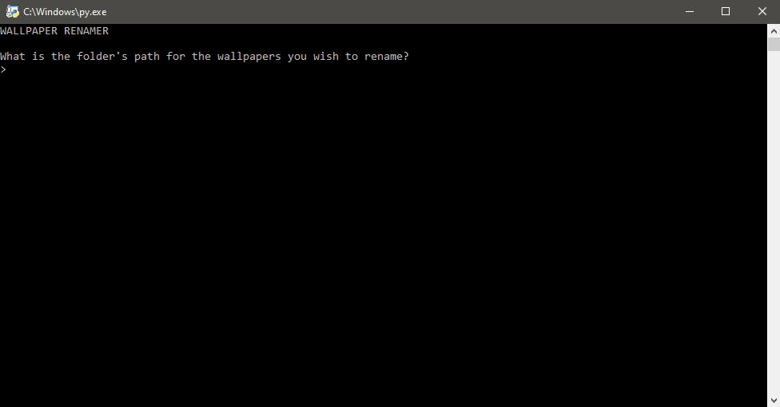
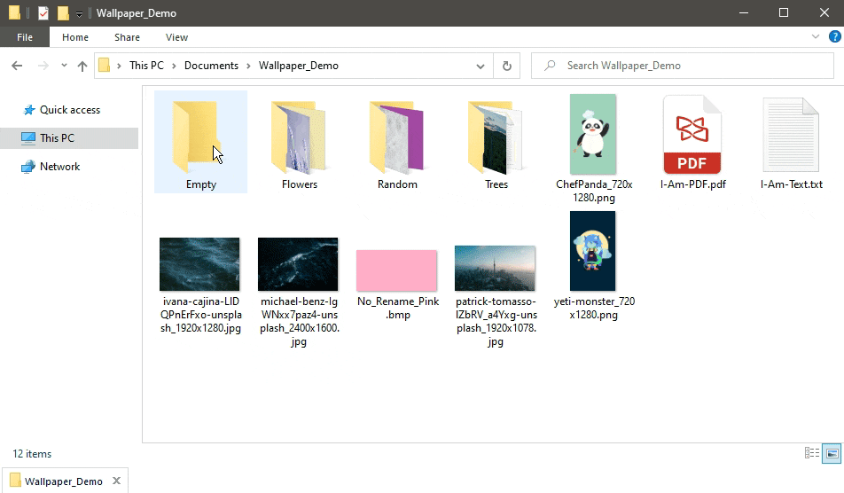

# Wallpaper Renamer
I wrote this to rename "WallpaperName.png" to "WallpaperName_1920x1080.png" but on a folder scale.

## Table of Contents
- [The Problem](#The-Problem)
- [Demo](#Demo)
- [Features](#Features)
- [Built With](#Built-With)
    - [How It Was Built](#How-It-Was-Built)
- [Installation](#Installation)
- [Changelog](#Changelog)
- [Notes](#Notes)
- [Road Map](#Road-Map)
- [License](#License)
- [Acknowledgements](#Acknowledgements)
- [Donations (Optional)](#Donations-(Optional))

## The Problem
I had a folder full of wallpapers I've acquired over years on the internet, many of which are different resolution sizes that may or may not look as nice on whatever screen (monitor, phone, tablet, etc) size I decided to apply it on. To solve this issue, adding the resolution size in the name would make it easier to determine if the wallpaper would fill the screen well enough. Instead of manually checking their dimensions from properties and then renaming them, which would take ages, I made this. It changes all my wallpapers in a folder from "WallpaperName.png" to "WallpaperName_1920x1080.png".

## Demo
For the purposes of making a demo, this is just a sample of the wallpapers I have on hand. If my file explorer looks a bit strange, QTTabBar is installed but it does not affect the demo in any way.

See [Acknowledgements](#Acknowledgements) for links to the wallpapers used.

### Folder Structure
Here's a rough breakdown of what I'll be demonstrating:

- Wallpaper_Demo            (23 files, 05 folders)
    - Empty                 (00 files)
    - Flowers               (05 files)
    - Random                (05 files)
        - Random Subfolder  (01 files)
    - Trees                 (05 files)

### Before
This is what the collection looks like before they are renamed including sub-folders. I've also thrown in a few `.txt`, `.pdf`, and `.bmp` files to show that they won't be renamed if there happens to be any in the folder. As well as included wallpapers that have been renamed. The folder `Empty` contains no files inside it to show what happens when `wallpaper_renamer.py` encounters it.

### Running `wallpaper_renamer.py`

In this demo, you can see it took seconds to run and finish.
Not shown: you can scroll back up to see all the changes and what was skipped.

### After

Not only was the main folder's wallpapers renamed, the subfolders were too. `.txt`, `.pdf`, and `.bmp` files were not touched and everything else was renamed.

## Features
Ability to:
- Rename all wallpapers (including subfolders containing wallpapers) in one go.
- See what files were changed and what was ignored.

## Built With
- [Python 3.8](python.org) with the help these Python modules:
    - os (built-in)
    - re (built-in)
    - [Pillow](https://pypi.org/project/Pillow/ (3rd-party)

### How It Was Built
#### OS
- `os.walk` to tell Python where the files are and browse any folders inside the folder path specified.
- `os.rename` used to rename the files.

#### Re (Regular Expression)
Used to check and ignore any wallpaper files that I had already been renamed. It would be redundant to see something like: wallpapername_1920x1080_1920x1080.png.

It also checks whether the extension was `.jpg`, `.jpeg`, and `.png`. Any other file extension found would be ignored.

#### Pillow
This was the only 3rd-party module that was used. It was used to check the file's image dimensions and pass the resolution size over to `os.rename`.

## Installation
Note: I've only tested it on Windows 10, so I can't confirm if it will work on Linux or Mac Operating Systems.

- Install Python 3.6 or newer.
    - You can grab the latest copy from http://python.org.
- Install [Pillow](https://pypi.org/project/Pillow/)
    - [Installation guide for Pillow](https://pillow.readthedocs.io/en/latest/installation.html).
- Download `wallpaper_renamer.py`.
- Run `wallpaper_renamer.py`.
    - Get the folder path for your wallpapers.
    - Paste or type in the folder path.
    - Wait for `wallpaper_renamer.py` to finish.

## Changelog
August 18, 2020:
- Updated `wallpaper_renamer.py`
    - Wallpapers are grouped into lists (renamed, ignored, and skipped) for better readability.
- Updated `README`
    - Rewrote and removed some sections
    - Added a demo section including GIFs
    - Added installation guide

## Notes
This script will only rename `.jpg`, `.jpeg`, and `.png` and will ignore other file extensions such as `.txt`, `.bmp`, `.svg`, etc. Alternatively, `wallpaper_renamer.py` could be used to rename any image file to include resolution size at the end. Python users may fork this project as their own and tweak what file extensions that are allowed to be included.

## Road Map
There are more features I would like to add but I currently don't have the time to dedicate to accomplishing them all at once. Consider this a pet project. Here are the list of improvements I would like to add (not in any particular order):
- Ability to remove resolution size from the name. Basically an `anti-wallpaper_renamer.py` but within `wallpaper_renamer.py`.
- Confirmation for everything that's to be renamed.
- Ask if there are any other folders with wallpapers that need to be renamed.
- Option to choose whether the resolution size is a prefix or suffix.
- Ability to save the changes on screen as a `.txt` .

## License 
Distributed under the MIT License. See `LICENSE` for more information.

## Acknowledgements
This project wouldn't be possible without [Pillow](https://pypi.org/project/Pillow/)

Thanks to [Unsplash](http://unsplash.com) for the majority of wallpaper used in this demo.

Larger resolution sizes can be found by following the links.

Everything is listed in alphabetical order by file name:
- [andrew-coelho-aL7SA1ASVdQ-unsplash](https://unsplash.com/photos/aL7SA1ASVdQ)
- [ben-den-engelsen-wJIq3S5mmM4-unsplash](https://unsplash.com/photos/wJIq3S5mmM4)
- [chad-madden-9HDfRHhCxME-unsplash](https://unsplash.com/photos/9HDfRHhCxME)
- [ivana-cajina-LlDQPnErFxo-unsplash](https://unsplash.com/photos/LlDQPnErFxo)
- [michael-benz-IgWNxx7paz4-unsplash](https://unsplash.com/photos/IgWNxx7paz4)
- [mike-marrah-vKNjdRBqep0-unsplash](https://unsplash.com/photos/vKNjdRBqep0)
- [patrick-tomasso-lZbRV_a4Yxg-unsplash](https://unsplash.com/photos/lZbRV_a4Yxg)
- [scott-webb-UjupleczBOY-unsplash](https://unsplash.com/photos/UjupleczBOY)
- [sharon-mccutcheon-SavQfLRm4Do-unsplash](https://unsplash.com/photos/SavQfLRm4Do)
- [thought-catalog-bGiMXk8sMHw-unsplash](https://unsplash.com/photos/bGiMXk8sMHw)

The 2D cartoon wallpapers were created by me, you can find them in [my Ko-fi Phone Wallpapers Album](https://ko-fi.com/album/Wallpaper-O5O012PWV). They were added for file extension variety as Unsplash only provided `.jpg` images.

## Donations (Optional)
Ko-fi is basically a virtual tip jar where you can support creatives for about the price of a cup of coffee.

At this time, I'm not very active on Ko-fi nor do I offer any rewards. If you love my work and feel like supporting me, hit the button below to get started.

Tipping is optional but I will appreciate any amount you choose to donate. Thank you (´• ω •`) ♡ !

